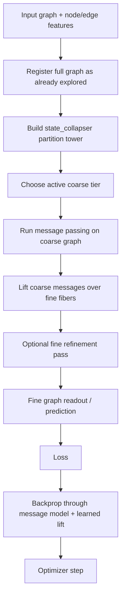

# Lifting Strategies For Hierarchical Graph Message Passing

## Status

First foundational design note for `HGraphML`.

This document records the initial design discussion for importing the
`state_collapser` quotient-tower idea into graph ML systems whose computations
are naturally described as dataflow across a graph.

The immediate motivating target is belief propagation, but the intended package
shape is broader: if a graph ML method can be expressed as local message passing
or dataflow across graph edges, then a `state_collapser`-style quotient tower
should be able to accelerate, organize, or regularize that computation by
running part of the computation on coarser graph tiers and lifting the resulting
messages back to finer tiers.

## Origin Of The Insight

The motivating observation comes from Abdullah N. Malik.

In `state_collapser`, the graph is the state/action graph of a reinforcement
learning problem. The thing flowing through the graph can be read in several
compatible ways:

- a single agent trajectory, like a Dirac delta moving through the graph
- a policy-induced probability flow across state/action paths
- value, reward, or policy information propagated across discovered transition
  structure

Malik's observation is that this is not essentially an RL-only picture. The
deeper structure is:

```text
graph carrying local dataflow
    -> quotient/coarsening tower of that graph
        -> coarse computation on cheaper graph tiers
            -> lift/refine results back to finer tiers
```

Belief propagation is a natural first import because the graph and the dataflow
are already explicit. A factor graph carries variables, factors, potentials, and
messages. Message updates are local algebraic operations. If quotient cells
collect graph regions with equivalent or nearly equivalent local message
behavior, then message passing can be performed upstairs/downstairs through a
tower instead of only on the original graph.

## Core Claim

Once the lifting rule is specified, much of the package architecture becomes
nearly automatic.

The reason is that most graph ML frameworks already expose some version of the
following surfaces:

- a graph object
- node features or variable states
- edge features or factor/potential data
- local message functions
- aggregation functions
- update functions
- training or inference loops

`HGraphML` does not need to replace those frameworks. It should wrap or
orchestrate them with a quotient-tower scaffold:

```text
graph/dataflow problem
    -> state_collapser-style tower construction
        -> graph ML message pass on coarse tier
            -> lift messages to fine tier
                -> optional refinement pass
```

The non-automatic part is algebraic. One must decide what it means to lift a
message computed on a quotient edge or quotient cell back to messages on the
preimage edges or nodes.

This document proposes two first-class lifting strategies.

## Basic Setup

Let

```text
q_i : G^i -> G^{i+1}
```

be one quotient step in a graph tower. A vertex or edge at tier `i+1` represents
a cell of vertices or edges at tier `i`.

For a graph message-passing method, suppose that tier `i` carries messages

```text
m^i_{u -> v} in M^i_{u -> v}
```

along directed computational edges. On the quotient tier, a coarse edge

```text
C -> D
```

represents some preimage family of fine edges

```text
q_i^{-1}(C -> D) = { u -> v | u in C, v in D }.
```

After running a message-passing update on tier `i+1`, we obtain a coarse message

```text
m^{i+1}_{C -> D}.
```

A lift is a rule that assigns fine-tier messages

```text
m^i_{u -> v}
```

for each fine edge `u -> v` lying over the coarse edge `C -> D`.

The package question is:

```text
How should a coarse message be distributed, copied, conditioned, or decoded back
onto the fine preimage?
```

That question is the graph-ML analogue of the `state_collapser` question:

```text
Once a policy/value/control signal has been learned on tier i+1, how does it
lift to executable behavior at tier i?
```

## Strategy 1: Uniform Pullback Lift

### Definition

The uniform pullback lift copies a coarse message to every fine edge in its
preimage:

```text
Lift_uniform(m^{i+1}_{C -> D})_{u -> v} := m^{i+1}_{C -> D}
```

for every `u -> v` with `u in C` and `v in D`.

If messages live in a vector space, probability simplex, log-potential space, or
other algebraic message object, this is the simplest possible pullback along the
quotient map.

### Interpretation

This lift says:

```text
The quotient computation has decided the message between cells.
Every representative fine edge inherits that same message until finer evidence
forces a distinction.
```

This is the graph-message-passing analogue of giving every representative of a
coset the same outgoing decision information. It is the most direct import of
the `state_collapser` runtime picture: every fine representative can move or
compute using the coarse cell's data.

### Exactness Condition

Uniform pullback is exact when the quotient relation is a congruence for the
message update algebra.

Informally, this means:

```text
Fine edges inside the same quotient edge would have received the same message
anyway.
```

For belief propagation, this requires compatibility between the partition and
the factor/variable structure. Fine variables or factors inside the same cell
must have message-update behavior that is identical after quotienting, or
identical up to an explicitly tracked symmetry.

### Approximate Use

When exact congruence fails, uniform pullback is still a useful approximation.
It gives a cheap coarse prior over the fine graph. A later refinement pass can
then correct local differences.

This is analogous to coarse-to-fine control in RL:

```text
coarse policy/value message
    -> copied to fine representatives
        -> local fine-tier correction
```

### Advantages

- It is simple.
- It is deterministic.
- It is easy to test.
- It has a clear exactness story.
- It works for many message domains without extra parameters.
- It gives the cleanest first import of `state_collapser` into graph ML.

### Risks

- It can over-smooth fine structure.
- It ignores within-cell heterogeneity.
- It can be wrong when quotient cells merge nodes with different potentials,
  degrees, evidence, or factor arity.
- It may cause coarse messages to dominate when a local correction pass is too
  weak.

### Package Surface

A first package surface could look like:

```python
from hgraphml.lifts import UniformPullbackLift

lift = UniformPullbackLift()
fine_messages = lift.lift(
    coarse_messages=coarse_messages,
    quotient_map=quotient_map,
    fine_graph=fine_graph,
)
```

This lift should be the default because it is the easiest to explain and the
best baseline for determining whether hierarchy helps at all.

## Strategy 2: Fiber-Normalized Disintegration Lift

### Definition

The fiber-normalized disintegration lift distributes a coarse message across the
fine preimage using a within-fiber weighting rule.

For each coarse edge `C -> D`, let

```text
F_{C,D} = { u -> v | u in C, v in D }
```

be its fine preimage edge fiber. Choose weights

```text
w_{u -> v}^{C,D} >= 0
```

such that

```text
sum_{u -> v in F_{C,D}} w_{u -> v}^{C,D} = 1.
```

Then define

```text
Lift_weighted(m^{i+1}_{C -> D})_{u -> v}
    := Decode(m^{i+1}_{C -> D}, w_{u -> v}^{C,D}, local_context(u -> v)).
```

In the simplest vector-space case, this may be:

```text
m^i_{u -> v} := w_{u -> v}^{C,D} * m^{i+1}_{C -> D}.
```

For probability messages, log messages, or normalized beliefs, the exact formula
depends on the message domain. The general principle is that the coarse message
is treated as aggregate mass, evidence, or potential, and the lift chooses a
disintegration of that aggregate object over the fine fiber.

### Interpretation

This lift says:

```text
The quotient computation determines the aggregate message between cells.
The lift decides how that aggregate message should be allocated among the fine
edges that realize the coarse edge.
```

This is closer to measure theory and probabilistic graphical models than uniform
copying. It treats quotienting as a pushforward of message mass and lifting as a
choice of conditional distribution along the fiber.

### Weight Sources

The fiber weights can come from several sources:

- uniform weights over the fine edge fiber
- degree-normalized weights
- potential-weighted edge scores
- evidence-conditioned local likelihoods
- learned attention scores
- previous fine-tier messages
- residual error from the last refinement pass

For belief propagation, natural first choices are:

- factor-potential weights
- local evidence likelihoods
- normalized previous-message magnitudes

### Exactness Condition

Weighted disintegration is exact when the chosen fiber weights match the true
conditional decomposition of the fine messages given the coarse message.

In probabilistic terms, if quotienting has pushed fine message data forward to a
coarse aggregate, then the lift is exact when it uses the correct conditional
law:

```text
fine message = coarse aggregate + correct conditional structure within fiber
```

This condition is stronger than the package can usually guarantee, but it gives
a clean target and a useful diagnostic.

### Approximate Use

In practice, this strategy is useful when quotient cells are meaningful but not
perfectly homogeneous. It preserves the coarse speed-up while allowing local
structure to affect the lifted messages.

This is the likely workhorse for nontrivial graph ML imports:

```text
coarse BP or GNN pass
    -> weighted lift using local potentials/features
        -> fine correction/refinement pass
```

### Advantages

- It handles within-cell heterogeneity better than uniform pullback.
- It can respect local evidence, potentials, or features.
- It connects naturally to probabilistic graphical models.
- It creates a path toward learned lifting rules.
- It makes hierarchical BP feel like a real graph-ML method rather than only a
  quotient-graph trick.

### Risks

- The lift is no longer canonical without a weight rule.
- Bad weights can introduce bias.
- Message normalization must be domain-aware.
- It is easier to accidentally break BP semantics.
- Tests must distinguish exact quotient cases from approximate cases.

### Package Surface

A first package surface could look like:

```python
from hgraphml.lifts import FiberNormalizedLift

lift = FiberNormalizedLift(
    weight_rule="potential",
    normalize="fiber",
)

fine_messages = lift.lift(
    coarse_messages=coarse_messages,
    quotient_map=quotient_map,
    fine_graph=fine_graph,
    local_context=local_context,
)
```

The implementation should not hard-code belief propagation. The lift should be
generic over message objects where possible, with domain-specific normalization
hooks for probability, log-probability, and vector messages.

## Why These Two Strategies Are Enough To Start

These two strategies give the first real design fork:

- `UniformPullbackLift` is the exact/symmetric/coset-style baseline.
- `FiberNormalizedLift` is the approximate/probabilistic/heterogeneous lift.

Together, they cover the two essential cases:

```text
The quotient cell is genuinely homogeneous.
The quotient cell is useful but internally heterogeneous.
```

Most early package architecture can now be written around a generic lift
interface:

```python
class MessageLift:
    def lift(self, coarse_messages, quotient_map, fine_graph, **context):
        ...
```

Once that interface exists, the rest of the framework becomes mostly ordinary
engineering:

- define graph adapters
- define message containers
- define quotient/tower construction wrappers
- define coarse message-passing calls
- define lift/refinement calls
- write examples against popular graph ML libraries

The mathematical novelty is concentrated in:

- the tower construction
- the lift rule
- the exactness/approximation diagnostics

Everything else is scaffold.

## Proposed `state_collapser`-Style Call

The first user-facing call should make the hack obvious:

```python
from hgraphml import collapse_messages
from hgraphml.lifts import UniformPullbackLift

result = collapse_messages(
    graph=factor_graph,
    message_passing=belief_propagation_step,
    lift=UniformPullbackLift(),
    tiers=3,
    iterations_per_tier=5,
)

beliefs = result.fine_beliefs
```

This says:

```text
Take an ordinary graph message-passing problem.
Build a state_collapser-style tower around it.
Run message passing on collapsed graph tiers.
Lift the resulting messages back down.
Return ordinary fine-graph outputs.
```

The point is not to invent a new graph ML ecosystem. The point is to make
hierarchical quotient computation available as a wrapper around existing graph
ML/message-passing machinery.

## Belief Propagation Example Sketch

Suppose a user has a factor graph and an ordinary BP update function:

```python
from hgraphml import collapse_messages
from hgraphml.adapters import FactorGraphAdapter
from hgraphml.lifts import FiberNormalizedLift

factor_graph = FactorGraphAdapter.from_pgmpy(model)

result = collapse_messages(
    graph=factor_graph,
    message_passing="belief_propagation",
    lift=FiberNormalizedLift(weight_rule="potential"),
    contraction_rule="local_message_equivalence",
    tiers=4,
    iterations_per_tier=8,
    refinement_iterations=3,
)

approx_marginals = result.node_beliefs()
```

In this sketch, `HGraphML` does not need to own the entire BP implementation.
Instead, it owns:

- the quotient tower
- the mapping between fine graph and coarse graph tiers
- the message lift
- the refinement schedule
- diagnostics comparing hierarchical and flat message-passing behavior

The backend can be `pgmpy`, `networkx`, `torch_geometric`, `dgl`, or an internal
minimal factor-graph implementation. The core idea is backend-independent.

## Example Of The Intended Hack

The first public demo should be deliberately small and slightly mischievous:

```python
from hgraphml import collapse_messages
from hgraphml.examples import make_repeated_grid_factor_graph
from hgraphml.lifts import UniformPullbackLift

graph = make_repeated_grid_factor_graph(
    width=32,
    height=32,
    repeated_patch_shape=(4, 4),
)

flat = graph.run_belief_propagation(iterations=40)

hier = collapse_messages(
    graph=graph,
    message_passing=graph.belief_propagation_step,
    lift=UniformPullbackLift(),
    contraction_rule="repeated_patch_equivalence",
    tiers=3,
    iterations_per_tier=10,
    refinement_iterations=5,
)

print(flat.elapsed_seconds)
print(hier.elapsed_seconds)
print(hier.max_marginal_error_against(flat))
```

This is the right first hack because it makes the claim testable:

```text
If the graph has repeated local structure, the quotient tower should exploit it.
If it does not, the method should degrade honestly into overhead.
```

## Design Consequence

This repository should not begin as a new monolithic graph ML framework.

It should begin as:

```text
state_collapser-style quotient/tower scaffolding
    + lift operators
    + adapters to existing message-passing systems
    + small examples proving when the hierarchy helps
```

That is why the lift strategies matter so much. They are the missing algebraic
bridge. Once they are named, the rest of the package can be organized by
ordinary framework-adapter engineering.

## Open Questions

- Should the first implementation target exact BP on synthetic symmetric factor graphs, approximate BP on heterogeneous graphs, or both?
    - **PO Answer:**
    I think approximate, because exact is just special case of approximate where every arrow has reverse. Do I understand correctly?
    - **Codex Reply:**
    Approximate should be the first target, but I would sharpen the exact/approximate distinction slightly. Exact BP is not exactly the special case where every arrow has a reverse, because ordinary BP already usually has directed messages in both directions along an undirected/factor edge. The stronger exactness condition is that the quotient partition must be compatible with the message-update algebra: fine messages inside the same quotient fiber must evolve identically, or identically up to a symmetry that the quotient explicitly tracks.

    So the intended first implementation should be approximate hierarchical message passing. Exact quotient BP then appears as the special case where the quotient cells are message-update congruence classes and the lift recovers the true fine-fiber messages. In package terms, this means we should design the API around approximate/lifted message passing from the start, while keeping exact symmetric examples as sanity tests.
- Should `HGraphML` depend on an existing package such as `networkx`, `pgmpy`, `torch_geometric`, or begin with a tiny internal graph/message interface?
    - **PO Answer:**
    Everywhere it possibly can, it shoudl use the most popular current industrial-grade tool instead of inventing shit. That said, don't make the package more complicated than it needs to be. It is, intially, just a check that this clever `state_collapser` call works.
    - **Codex Reply:**
    This points toward a small PyTorch-first implementation, with graph-library adapters added only where they make the demo cleaner. The first milestone should not invent a full graph ML framework. It should own only the hierarchical quotient scaffold, the lift module, and the orchestration needed to prove that a collapsed message-passing call can run and train.

    My current read is that `torch` should be the first hard dependency because learned lifts and backprop are central to the first proof. `torch_geometric` is probably the first serious external graph ML adapter after that, because it is the most natural industrial-grade graph neural network surface. `networkx` may still be useful for tiny inspectable graph construction, but it should not define the training path. `pgmpy` is relevant to classical BP, but probably not the first dependency if the first milestone is differentiable trainable message passing.
- Should tower construction be imported directly from `state_collapser`, vendored conceptually, or reimplemented as a graph-ML-specific partition layer?
    - **PO Answer:**
    If possible, importted directly and apply with minimal rework. The only major thing that I see changing is that there is no exploration. You have to set it up as if the whole graph is already explored. Do you understand?
    - **Codex Reply:**
    Yes, I understand. In `state_collapser`, tower construction is normally tied to discovered RL state/action structure that grows over time. In `HGraphML`, the graph ML case starts with the whole computational graph already present. So the right import is not the exploration loop; it is the partition/tower machinery applied to a fully registered graph at initialization time.

    The adaptation should be: build a complete base registry from the known graph, treat all nodes and edges as already discovered, apply a contraction schema or partition rule over the full graph, and produce a static or mostly static tower before message passing begins. Later versions can support dynamic graph updates, but the first milestone should use `state_collapser` as a full-graph quotient-tower constructor.
- What should the first benchmark compare: wall-clock time, message update
  count, convergence iterations, marginal error, or all of these?

    - **PO Answer:**
    The first benchmark is just that it works, like that this new tiered message passing is somethign that can get plugged into backprop and trained. Matrix size doesn't matter at this point... 8-dimesnional feature vectors are fine.
    - **Codex Reply:**
    Agreed. The first benchmark should be a viability benchmark, not a speed-up benchmark. The success condition is simply that the clever call is real: it builds a tower, runs tiered message passing, lifts messages back to the fine graph, computes a loss, backpropagates through the learned lift/message path, and updates parameters without shape hacks or detached gradients.

    A tiny synthetic graph with 8-dimensional node or message features is enough. The benchmark should record boring but decisive facts: forward pass succeeds, loss is finite, gradients are nonzero on the learned lift parameters, one optimizer step changes those parameters, and repeated steps reduce or at least move the training objective on a toy target. Wall-clock speed-up should be explicitly out of scope for milestone one.
- Should learned lifts be part of the first milestone, or should the first
  milestone stay with deterministic algebraic lifts only?
    - **PO Answer:**
    Absolutely it should include learned weights.
    - **Codex Reply:**
    Then learned lifts are not an optional later feature; they are part of the first honest proof. The deterministic lifts still matter as baselines and sanity checks, but the core `HGraphML` claim should include a differentiable learned fiber lift from the beginning.

    This changes the center of the architecture. The first package surface should probably include something like `LearnedFiberLift`, implemented as a small PyTorch module that takes coarse messages plus fine-edge/fiber context and emits fine messages or fine-edge weights. The first demo should prove that gradients flow through this lift. In other words, milestone one is not merely hierarchical BP; it is trainable hierarchical graph message passing using `state_collapser`-style quotient scaffolding.

#### PO Request:
Show me a mock `tree` for the package's `/src`, and a light `mermaid` control flow diagram to give me quick picture of the system.

#### Codex Response:
The first `src` layout should stay small enough that the package still feels like
a clever import of `state_collapser`, not a new graph ML universe.

```text
src/
└── hgraphml/
    ├── __init__.py
    ├── collapse.py
    ├── py.typed
    │
    ├── graph/
    │   ├── __init__.py
    │   ├── data.py
    │   ├── fibers.py
    │   └── tower_adapter.py
    │
    ├── messages/
    │   ├── __init__.py
    │   ├── containers.py
    │   ├── passing.py
    │   └── readout.py
    │
    ├── lifts/
    │   ├── __init__.py
    │   ├── base.py
    │   ├── uniform.py
    │   ├── fiber_normalized.py
    │   └── learned.py
    │
    ├── adapters/
    │   ├── __init__.py
    │   ├── state_collapser.py
    │   └── torch_geometric.py
    │
    ├── training/
    │   ├── __init__.py
    │   ├── losses.py
    │   ├── objectives.py
    │   └── train_step.py
    │
    ├── examples/
    │   ├── __init__.py
    │   ├── toy_graphs.py
    │   └── learned_lift_demo.py
    │
    └── diagnostics/
        ├── __init__.py
        ├── gradients.py
        └── viability.py
```

The central file is `collapse.py`. It should expose the package-defining call:

```python
from hgraphml import collapse_messages
```

The key supporting namespaces are:

- `graph/`: the minimal graph and fiber data needed by the package.
- `adapters/state_collapser.py`: the bridge that treats the full graph as
  already explored and builds a `state_collapser` partition tower.
- `messages/`: message containers and ordinary message-passing hooks.
- `lifts/`: deterministic and learned lift operators.
- `training/`: the tiny PyTorch training/check surface proving that gradients
  flow through the hierarchical message path.
- `examples/`: the first toy graph and trainable learned-lift demo.
- `diagnostics/`: checks for finite loss, nonzero gradients, changed parameters,
  and fine-message shape consistency.

The control-flow picture is:



For milestone one, the package should prove this loop works before claiming any
speed-up. The first success criterion is not that the hierarchy is faster. The
first success criterion is that the `state_collapser` tower can sit inside a
trainable graph-message-passing computation without breaking PyTorch
autograd.
